# chronosBT - hft backtester with hardware acceleration

an ultra low latency high-frequency trading backtester built around a
cache-friendly limit order book in c++20, with a simulated fpga feature-extraction
pipeline described in systemverilog & bridged to the software engine over a
modelled axi-stream / pcie interface.

## architecture

```mermaid
flowchart LR
    %% ── watermark ───────────────────────────────
    BRAND["<b>⏱ chronos-bt</b><br/>hardware-accelerated hft backtester<br/>— c. jagdeo —<br/>github.com/k0nnect/chronos-bt"]
    click BRAND href "https://github.com/k0nnect/chronos-bt" "chronos-bt · c. jagdeo" _blank
    BRAND ~~~ feed

    subgraph feed["phase 2 · feed pipeline"]
        direction TB
        GEN["synthetic generator<br/>(itch-like wire bytes)"]
        PCAP["offline pcap reader (phase 5)<br/>mmap · eth → ip → udp (zero-copy)"]
        PARSE["zero-copy parser<br/>frame_cursor · decode"]
        RING["lock-free spsc ring<br/>(feed thread → engine thread)"]
        GEN --> PARSE --> RING
        PCAP --> PARSE
    end

    subgraph book["phase 1 · l3 order book"]
        direction TB
        BOOK["flat tick-indexed levels<br/>intrusive fifo queues · O(1) id map"]
        ANALYTICS["spread · mid · micro-price<br/>order-flow imbalance"]
        BOOK --> ANALYTICS
    end

    subgraph engine["phase 3 · backtest engine"]
        direction TB
        APPLY["apply event<br/>+ queue-consumption signal"]
        FILL["queue-aware fill model<br/>latency · partials · fees<br/>+ market impact (temp · perm · adverse selection)"]
        ALPHA["alpha engine (phase 6)<br/>q.16 multi-level obi · kalman filter"]
        STRAT["crtp strategies<br/>micro-price · statistical mm"]
        METRICS["metrics<br/>p&l · drawdown · sharpe"]
        APPLY --> FILL --> STRAT
        ALPHA --> STRAT
        FILL --> METRICS
    end

    subgraph hw["phase 4 · fpga accelerator (verilator cosim)"]
        direction TB
        AXI["axi4-stream bridge<br/>128b in / 64b out"]
        RTL["feature_extractor.sv<br/>frac divider · micro-price · imbalance"]
        REF["bit-exact reference<br/>(golden Q16.16 model)"]
        AXI --> RTL
        RTL -.->|rtl == reference| REF
    end

    subgraph viz["phase 5 · replay dashboard"]
        direction TB
        TRACE["jsonl trace logger<br/>book · pnl · alpha state"]
        DASH["react / vite dashboard<br/>depth · pnl · ticker · playback"]
        TRACE --> DASH
    end

    RING -->|market_event| APPLY
    APPLY -->|book mutations| BOOK
    BOOK -->|top-of-book snapshot| STRAT
    BOOK -->|multi-level snapshot| ALPHA
    STRAT -->|orders via gateway| FILL
    METRICS -->|per-tick snapshot| TRACE
    BOOK ==>|book-update beat| AXI
    REF -.->|features ≈ order_book| ANALYTICS

    %% ── styling ─────────────────────────────────────────
    classDef brand fill:#0d1117,stroke:#1f6feb,stroke-width:1.5px,color:#e6edf3;
    class BRAND brand;
```



## status

| phase | scope | state |
|------:|-------|-------|
| 1 | core data structures + software l3 order book | done |
| 2 | binary feed handler (itch-like) + spsc ring buffer | done |
| 3 | backtest engine, strategy api, fill simulation + market impact | done |
| 4 | systemverilog feature engine + verilator cosim bridge | done |
| 5 | offline pcap replay + jsonl trace + react/vite replay dashboard | done |
| 6 | statistical maker: q.16 alpha engine + inventory-aware quoting | done |

## layout

```
include/hft/        public headers (header-only core)
  core/             fixed-width types, cache helpers, compiler intrinsics,
                    byte-order helpers, memory pool
  book/             price level, order-id index map, l3 order book, event apply
  feed/             wire protocol, zero-copy parser, spsc ring, feed handler,
                    synthetic market generator, pcap structures + mmap reader
  engine/           multi-level book-update snapshot, crtp strategy + order
                    gateway, queue-aware fill model, fixed-point market-impact
                    model, metrics, backtest engine
  signals/          q.16 alpha engine (multi-level obi + constant-gain filter)
  strategies/       micro-price maker, statistical (alpha + inventory) maker
  metrics/          jsonl trace logger + strategy trace-extras
hardware/           systemverilog accelerator + verilator cosim
  rtl/              frac divider, micro-price, volume-imbalance, feature_extractor,
                    axi-stream interface
  dpi/              fixed-point reference + verilated-model c++ wrapper
  tb/               systemverilog testbench + c++ cosim cross-check
src/                executables / translation units (drivers, pcap reader,
                    statistical-maker library)
tests/              assert-based unit tests (no external framework)
bench/              standalone micro-benchmarks
frontend/           vite + react + typescript replay dashboard (tailwind, recharts)
cmake/              shared compiler/optimisation flags
scripts/            build helpers
data/               captured / synthetic market data
```

## the order book

phase 1 implements an l3 (per-order) book optimised for the hot path:

- **prices are integer ticks.** each side owns a flat, directly-indexed array of
  price levels over a fixed band, so tick → level is one subtraction.
- **resting orders live in a pre-reserved object pool** and are threaded into
  per-level fifo queues with intrusive 32-bit links, preserving time priority.
- **order-id → slot lookup** is an open-addressing flat map; cancels and
  executes are O(1).
- **best bid/ask are cached indices**, rescanned over contiguous memory only
  when a top level empties.
- **zero heap allocation, no locks and no exceptions on add / cancel / execute.**

analytics computed directly from level aggregates: spread, mid, size-weighted
micro-price, and multi-level order-flow imbalance — the same quantities the
phase 4 fpga engine will compute in hardware.

## the feed pipeline

phase 2 turns a raw binary market-data stream into book mutations:

- **wire protocol** — an itch-like binary format: a 2-byte big-endian length
  prefix per frame, then a fixed width big-endian message body (add / execute /
  cancel / delete / replace / trade). packed structs pin the on-wire sizes.
- **zero-copy parser** — `frame_cursor` walks the buffer handing back body
  pointers without copying; `decode` reads fields with `load_be` straight into a
  normalized `market_event`. alignment-safe, strict-aliasing-safe, and resilient
  to a truncated trailing frame (it stops and reports bytes consumed).
- **lock-free spsc ring** — wait-free single-producer/single-consumer queue with
  head/tail on separate cache lines and per-side cached indices, so the common
  case never reads the contended atomic. it is the wire between the feed thread
  and the engine thread.
- **feed handler** — drives bytes → events → a sink (a vector in tests, the ring
  in the live path), tracking parsed / malformed / consumed counters.
- **synthetic generator** — produces a deterministic, internally consistent itch
  stream and reports the exact resting-order count the book must hold after
  replay, which the integration test asserts against.

representative single-machine throughput (release, `-O3 -march=native`): decode
~3.5 ns/msg (~8 GB/s), cross-thread ring hop ~25 ns, full feed→ring→book pipeline
~70 ns/event. run `./build/bench_feed` to reproduce.

## the backtest engine

phase 3 is the trading loop: events become book mutations, simulated fills,
strategy decisions and metrics, with no virtual dispatch and no hot-path
allocation.

- **crtp strategy** — strategies derive from `strategy<Derived>`; the engine
  dispatches `on_market_event` / `on_book_update` / `on_order_fill` through a
  `static_cast`, never a vtable. orders flow back through a concrete
  `order_gateway` (a fixed staging buffer the engine drains each tick), so the
  strategy stays decoupled from the book/fill-model types.
- **queue-position-aware fill model** — our orders are not inserted into the
  feed-driven book (that would corrupt replay); instead each working order tracks
  the real volume resting ahead of it and only fills once that queue trades out.
  models tick-to-trade latency, partial fills, marketable/market taker sweeps
  across levels, and maker/taker fees (negative maker bp = rebate).
- **market-impact model** (optional, off by default) — when enabled the fill model
  stops treating liquidity as free and static: taker sweeps pay temporary slippage,
  leave a decaying permanent skew on the fair mid, and degrade the queue position of
  our own resting orders. see below.
- **metrics engine** — O(1) per update, no trade history: signed average-cost
  realized/unrealized p&l, fees, position, peak inventory, max drawdown, and a
  welford accumulator for a sharpe estimate.
- **backtest engine** — resolves each event's queue-consumption signal from the
  pre-mutation book, applies it, ticks the fill model, delivers fills to strategy
  and metrics, hands the strategy a fresh top-of-book snapshot, and marks to
  market — all templated on the concrete book and strategy.
- **sample strategy** — a micro-price market maker that joins the inside, leans
  on micro-price/imbalance to withdraw from the side about to be run over, and
  respects a hard inventory cap. run `./build/micro_price_mm`.

## market impact

by default the fill model assumes idealized liquidity: a taker pays exactly the
displayed price at each level and our own flow never moves the market. that flatters
passive edge and ignores the cost of size. set `fill_config::enable_impact` and the
model drives a fixed-point impact accumulator (`engine/market_impact.hpp`) that adds
the three textbook execution-cost channels — all in integer Q.16 arithmetic (the same
FRAC=16 format as the fpga datapath), so the hot path never touches the fpu:

- **temporary impact** — an immediate, level-depletion-**linear** concession charged
  per taker child fill: taking a whole displayed level costs `temp_coeff` ticks, half
  the level costs half that. realized taker prices come out strictly worse than the
  idealized sweep — the direct cost of crossing with size.
- **permanent impact** — a **square-root participation law**,
  `skew += perm_coeff · sqrt(filled / rolling_volume)`, signed by aggressor direction
  (a buy lifts the fair mid, a sell depresses it). the rolling-volume denominator is an
  ewma of observed trade size, floored so the law is well-defined from the first tick.
  each event the accumulated skew is multiplied by a `decay` factor in [0,1), so a
  single trade's footprint relaxes geometrically — the propagator picture, and the
  channel through which a large execution shows up as measurable price decay on the
  marks that follow it.
- **queue degradation (adverse selection)** — our aggressive flow inflates the
  `queue_ahead` of our own resting passive orders (scaled by the same sqrt-participation
  term): a footprint of size signals intent and draws faster liquidity ahead of us, so
  we wait longer for the favourable fills and are left with the toxic ones.

the math is exact and self-contained: a digit-by-digit integer square root, 128-bit
intermediate products, and doubles confined to configure time. `test_market_impact`
pins the fixed-point primitives and proves, against the idealized baseline the same
code path produces with impact off, that large executions move realized prices,
decay the mid, degrade passive fills, and lower marked p&l.

## the statistical market maker

phase 6 replaces the micro-price maker with a depth-aware, inventory-managed
strategy that reads multi-level book structure & smooths it before it quotes.
everything on the hot path is integer Q.16 fixed point with zero heap allocation;
doubles appear only at configure time.

- **alpha engine** (`signals/alpha_engine.hpp`) — two pieces. first a
  volume-weighted **order-book imbalance** over the top 5 levels of each side, with
  a linear taper `{5,4,3,2,1}` so flow near the touch (the most predictive) weighs
  most; the result is signed & bounded to `[-1,1]`. second a **constant-gain
  alpha-beta filter** — the steady-state form of a kalman filter that tracks a
  level & a velocity with fixed gains, denoising the tick-to-tick obi into a stable
  alpha with two state words, two multiplies & two adds per update (no history, no
  allocation). the multi-level depth it needs rides along on the engine's
  `book_update` snapshot, so the strategy never re-walks the book.
- **quoting** (`strategies/statistical_mm.hpp`) — from the filtered alpha & its own
  inventory the maker derives two integer controls. **skew** shifts the quote
  center: lean *with* the predicted move (alpha) to earn the drift, lean *against*
  inventory to mean-revert position risk back toward flat. **width** widens the
  half-spread when `|alpha|` or `|inventory|` is large — strong alpha means the
  resting side is about to be adversely selected (exactly the toxicity the
  market-impact module models as permanent skew + queue degradation), so the maker
  demands more edge before resting there. it never quotes tighter than the touch
  (a tighter computed price joins the inside; widening steps it out behind the
  touch), & a hard position cap stops it quoting a side that would breach the limit.
- **drivers & tests** — `test_alpha_engine` pins the obi (sign, bounds,
  near-level dominance) & the filter (priming, steady state, monotone tracking);
  `test_statistical_mm` checks it quotes an uncrossed book, respects the inventory
  cap, & skews its center with the alpha. run the full pcap-fed backtest with
  `./build/stat_mm` (see below).

## offline pcap replay

phase 5 lets the engine consume real captured multicast feeds instead of only the
synthetic generator. `feed/pcap_reader.hpp` memory-maps a `.pcap` trace once
(`PcapReader`, the only translation unit that touches `<sys/mman.h>`) & exposes a
**zero-copy frame cursor** that peels ethernet → ipv4 → udp off each record &
hands the raw udp payload — our itch-like stream — straight to the existing
`itch::decode`, no copy & no allocation. the cursor advances by exactly the byte
length each pcap record header declares, so a non-udp or truncated record is
skipped cleanly rather than walking off the mapping. `feed/pcap_structures.hpp`
pins every framing layout with `static_assert`s on its wire size.

```sh
./build/stat_mm                 # synthesizes a pcap, replays it through the maker
./build/stat_mm capture.pcap    # or replay a real ethernet/ipv4/udp itch capture
```

with no argument the driver builds a deterministic capture (wrapping a synthetic
itch stream in real eth/ip/udp framing), replays it, & writes `stat_trace.jsonl`.
`test_pcap` exercises the same path against a hand-built mock savefile, including
ipv4 options, skipped arp/tcp records & a truncated tail.

## the replay dashboard

phase 5 also ships a visual replay dashboard under `frontend/` — vite + react +
typescript, tailwind dark theme. the c++ side streams an append-only **jsonl
trace** (`metrics/trace_logger.hpp`): one allocation-free line per logging
interval carrying best bid/ask, the top-5 book levels, position & realized p&l,
plus an optional `"a"` object with the statistical maker's alpha / obi / skew /
inventory state. the dashboard loads that file & replays it frame by frame:

- a cumulative **depth ladder** over the top 5 bid/ask levels,
- a realized **p&l curve** (recharts),
- a scrolling **execution ticker** (prints derived from position deltas),
- a **playback controller** (play / pause / speed / scrub) over the trace,
- a live **obi / alpha** readout when the trace carries strategy state.

```sh
cd build && ./micro_price_mm   # writes ./build/trace.jsonl, or
./build/stat_mm                # writes ./build/stat_trace.jsonl (with alpha state)

cd frontend && npm install && npm run dev    # http://localhost:5173
```

upload a `.jsonl` trace with **upload jsonl**, or hit **load sample** for the
bundled capture. nothing is uploaded anywhere — parsing is entirely client-side.

## the hardware accelerator

phase 4 offloads feature extraction (micro-price + volume imbalance) to a
simulated fpga described in synthesizable systemverilog and co-simulated with
verilator.

- **fixed-point datapath** — micro-price is computed as
  `bid + (ask - bid) * weight` with `weight = bid_qty / (bid_qty + ask_qty)`, a
  proper fraction produced by a pipelined **radix-2 shift/subtract fractional
  divider** (no inferred `/`). imbalance reuses the same divider on
  `|bid_qty - ask_qty| / (bid_qty + ask_qty)` with the sign reapplied. both
  datapaths share a FRAC+3 cycle latency, are fully pipelined (one result/cycle),
  use strictly non-blocking sequential logic, and carry the `valid` bit through
  every stage.
- **axi4-stream** — a 128-bit inbound book-update beat and a 64-bit outbound
  feature beat, with a standard `tvalid`/`tready`/`tlast` interface.
- **bit-exact reference** — `hardware/dpi/feature_reference.hpp` is the single
  source of truth for the fixed-point math; the rtl mirrors it exactly. it is
  validated against the floating-point `order_book` in `test_feature_golden`
  (no verilator needed): across ~200k two-sided states the worst error is 3 ulp
  (micro-price) and 1 ulp (imbalance) of Q16.16.
- **cosimulation** — `FpgaFeatureEngine` wraps the verilated model and drives its
  clock, modelling the pipeline latency. `hardware/tb/cosim_check.cpp` streams the
  phase-2 feed through the rtl and asserts `rtl == reference` bit-for-bit and
  `reference == order_book` within the ulp window. a systemverilog self-checking
  testbench (`hardware/tb/tb_feature_extractor.sv`) covers the rtl standalone.

### building the hardware layer

requires [verilator](https://verilator.org) (5.x recommended). the rest of the
project builds and tests without it.

```sh
cmake -S . -B build -DCMAKE_BUILD_TYPE=Release -DHFT_BUILD_HARDWARE=ON
cmake --build build -j
ctest --test-dir build -R hardware_cosim --output-on-failure   # rtl vs reference
cmake --build build --target hardware_lint                     # verilator --lint-only
./build/bench_hardware                                         # sw vs hw comparison

# run the pure-systemverilog testbench directly:
verilator --binary --timing -Wall --top-module tb_feature_extractor \
  hardware/rtl/axi_stream_if.sv hardware/rtl/frac_divider.sv \
  hardware/rtl/micro_price.sv hardware/rtl/volume_imbalance.sv \
  hardware/rtl/feature_extractor.sv hardware/tb/tb_feature_extractor.sv
./obj_dir/Vtb_feature_extractor
```

## build

requires cmake ≥ 3.20 and a c++20 compiler (gcc 11+, clang 13+, or msvc 19.3+).

```sh
cmake -S . -B build -DCMAKE_BUILD_TYPE=Release
cmake --build build -j
ctest --test-dir build --output-on-failure
./build/hft_demo
```

`scripts/build.sh` wraps the same steps. the build produces four drivers —
`hft_demo` (book demo + micro-benchmark), `micro_price_mm` & `stat_mm` (full
backtests), plus the `bench_feed` micro-benchmark — alongside the unit-test suite.

release builds compile with `-O3 -march=native -mtune=native`, link-time
optimization, and aggressive scalar/vector flags (see `cmake/compilerflags.cmake`).
